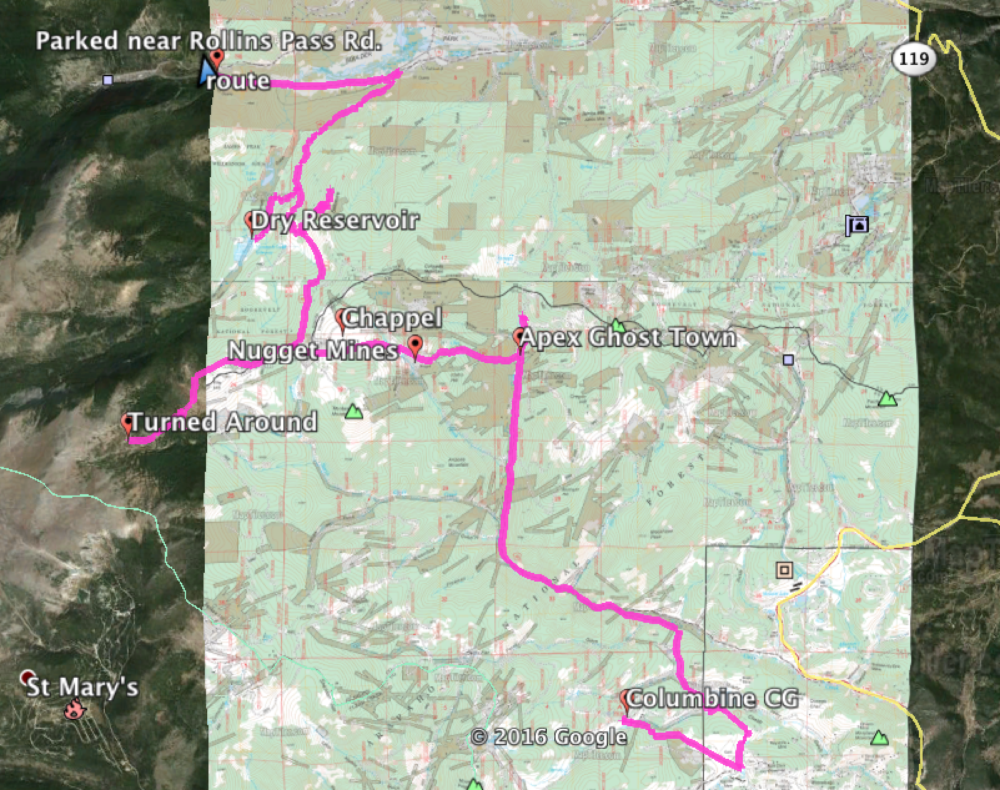

# The (almost) Ghost Town of Apex,CO

This was route today

I parked near the intersection of Tolland Rd. and Rollins Pass Rd.  On the bike, I headed East to Mammoth Gulch Rd. and went up to the old Mammoth Reservoir, which has been dry for a long time.

The old sign at the reservoir:

[Apex, CO](http://www.ghosttowns.com/states/co/apex.html) can't truly be called a ghost town because it has permanent residents.  I saw several people around and cars moving around when I was there.  The road through town is hard packed dirt.  Pretty wide and easy to travel in any vehicle.
